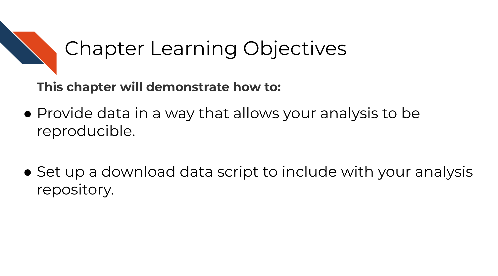

# Providing data

## Learning Objectives



The first part of any analysis should be getting all the data needed to run it. Data come in all kinds of formats and sizes so while we can't give specifics on how to share your data we can provide these guidelines:

### Overview of data sharing

- The data to be shared does not contain <a href="https://jhudatascience.org/Data_Management_for_Cancer_Research/data-privacy.html" target="_blank"> PII (personal identifiable information) or PHI (protected health information) information</a>.
- The data are accessible by a download script that is automatically downloaded when re-running the analysis.
- Every data file needed to run the analysis is available.
- The data are downloaded to files in an organized manner. For more about project organization, see [this chapter from the Introduction to Reproducibility course](https://jhudatascience.org/Reproducibility_in_Cancer_Informatics/organizing-your-project.html).

### A very general example of a data download bash script

As far as _how_ to have your data downloaded, this will be dependent on where and how it's stored online.
The most general form of a data download script might look like this:
```
#!/bin/bash

# This is a template script for downloading data using the wget command
# See docs here: https://www.gnu.org/software/wget/manual/wget.html

mkdir <FOLDER_TO_SAVE_TO>

# To see wget options, use -h (the help flag)
wget -h

wget -O <FOLDER/FILE_TO_SAVE_TO> <URL>
```

You can download this [general template download file here](https://raw.githubusercontent.com/AlexsLemonade/training-specific-template/main/working-with-your-data/template-scripts/wget-TEMPLATE.sh) [@Shapiro2021].

### Examples of data download scripts

- [Downloading data from GEO with GEOquery](http://genomicsclass.github.io/book/pages/GEOquery.html)
- [Data download script for multiple files of the same place](https://github.com/AlexsLemonade/training-modules/blob/master/machine-learning/setup/00-data-download.sh)
- [Data download script - refine.bio example](https://github.com/jhudsl/reproducible-R-example/blob/main/00-download-data.py)

For more about data sharing techniques, see the <a href="https://jhudatascience.org/Data_Management/data-sharing.html" target="_blank">Computing and Data Management course</a>.
