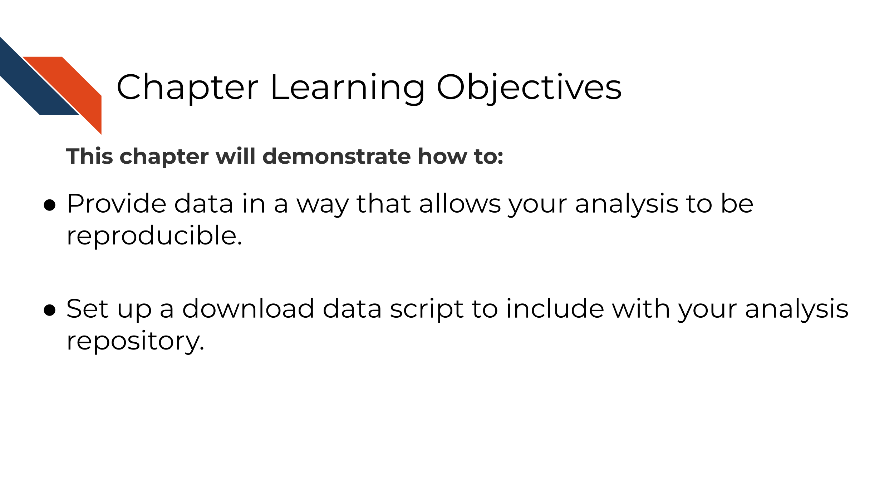

# Providing data

## Learning Objectives

The first part of any analysis should be getting all the data needed to run it. Data come in all kinds of formats and sizes so while we can't give specifics on how to share your data we can provide these guidelines:

### Overview of data sharing

- The data to be shared does not contain <a href="https://jhudatascience.org/Computing_and_Data_Management/data-privacy.html" target="_blank">PII (personal identifiable information) or PHI (protected health information) information</a>.
.
- The data are accessible by a download script that is automatically downloaded when re-running the analysis.
- Every data file needed to run the analysis is available.

For more about data sharing techniques, see the <a href="https://jhudatascience.org/Computing_and_Data_Management/data-sharing.html" target="_blank">Computing and Data Management course</a>.
