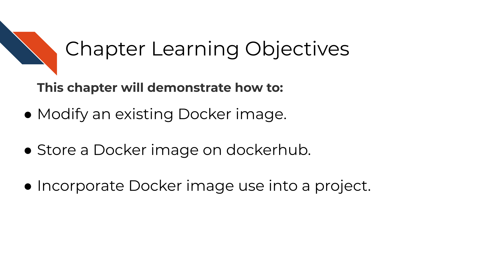
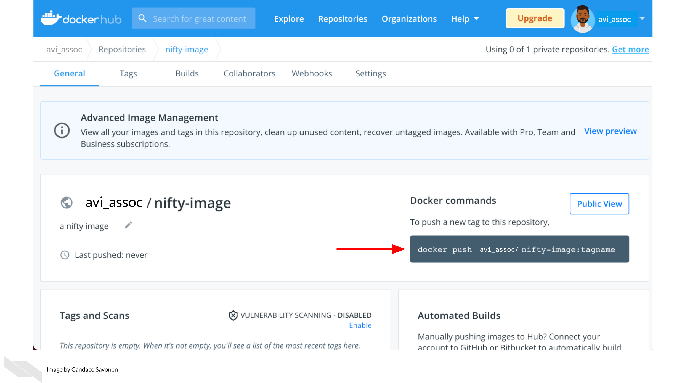

# Modifying a Docker image

## Learning Objectives



***

The docker image you are using from the last chapter was pre-made for you, but you will find depending on the needs of your project, that you may need different packages installed. In this chapter we will introduce you to the basics of how to manage your own Docker image.

## Managing images

Images can be on your own computer or on dockerhub.
To see your list of images on your computer, you can go to Docker desktop. From here you will want to delete images and containers periodically because they do take up room on your computer.


To see what images you have on your internet repository, you can log on to dockerhub.
[Go here to login (or create a username if you have not yet)](https://hub.docker.com/).


After you sign into dockerhub, you can see the list of repositories you have stored online. At this point, you won’t have any if you just created your dockerhub account. To create a new repository, click the ‘Create Repository’ button.


Upon adding the new repository to dockerhub, you will need name it the same as whatever you are calling it locally. You can put a description and name and click create. On the right it shows how you can interact with this from your local command line.


After you've created the image repository, you will be brought to the image repository page.
It will tell you `Last pushed: never`. On the right it will tell you the command you will need in order to push the image to dockerhub.



Go to your [local command line](https://towardsdatascience.com/a-quick-guide-to-using-command-line-terminal-96815b97b955) and use the command specified on the right side of your repository page. You don't have to specify a tagname if you don't want to.  If you don't want to specify a tagname, leave off the `:tagname` if you like.

Now you will be able to test pulling your image using `docker pull <image name>` like we did in the previous chapter.

Docker images can be pulled from being stored online but these images are built originally from a `Dockerfile`.

## Exercise: Build a Docker image

A Dockerfile is a recipe for how to build a docker image. The best way to learn to write Dockerfiles is to start off with one that is already written and modify it for your needs.

You can practice building a docker image by downloading the dockerfiles we have started and changing it slightly.

### Download an example Dockerfile

<details> <summary> Get the Python Dockerfile </summary>

Download the example Dockerfile for Python analyses.

```
wget https://raw.githubusercontent.com/jhudsl/Adv_Reproducibility_in_Cancer_Informatics/main/resources/python-docker/Dockerfile
```
If you get a message like `command not found` that means you will need to install [`wget`](https://www.jcchouinard.com/wget/).

Altervatively, you can navigate to the [Dockerfile's page on GitHub](https://raw.githubusercontent.com/jhudsl/Adv_Reproducibility_in_Cancer_Informatics/main/resources/python-docker/Dockerfile) and use `File` > `Save as` but do not add any suffix to the end of the file (no `.txt` or anything). Just save it as `Dockerfile`.

</details>

<details> <summary> Get the R Dockerfile </summary>

Download the example Dockerfile for R analyses.

```
wget https://raw.githubusercontent.com/jhudsl/Adv_Reproducibility_in_Cancer_Informatics/main/resources/r-docker/Dockerfile
```
If you get a message like `command not found` that means you will need to install [`wget`](https://www.jcchouinard.com/wget/).

Altervatively, you can navigate to the [Dockerfile's page on GitHub](https://raw.githubusercontent.com/jhudsl/Adv_Reproducibility_in_Cancer_Informatics/main/resources/r-docker/Dockerfile) and use `File` > `Save as` but do not add any suffix to the end of the file (no `.txt` or anything). Just save it as `Dockerfile`.

</details>

### Build a Docker image from a Dockerfile

Place this newly downloaded Dockerfile with the rest of your project files.

Build a docker image from this Dockerfile using the command below, but replace `image_name` with what you would like your modified image to be called.   

```
docker build -f Dockerfile . -t image_name
```

Navigate back to your Docker desktop and the `images` window. If your image built successfully, you should see a new image in your list!

### Modify a Docker image

If you want add or remove a package from a Docker image, you'll need to modify the Dockerfile.
Using your preferred text editor (or RStudio or Jupyter Lab), open up the Dockerfile.

You will see the first line in the Docker image is a `FROM` command. This is a command that will take another docker image to start from.
- For our **R example**, we are starting off with an image that already has R and the tidyverse. - For our **Python example** we are starting off with an image that already has Python and Jupyter Lab.

There are so many Docker images out there, that it might be that someone has already created a docker image with most of the functionality you need for your project.

`FROM` is one of the [main commands that a Dockerfile can take as described by their documentation](https://docs.docker.com/develop/develop-images/dockerfile_best-practices/):

> **FROM** creates a layer from the another Docker image.
> **COPY** adds files from your Docker client’s current directory.
> **RUN** builds your application with make.
> **CMD** specifies what command to run within the container.

### Add to the Dockerfile

To get a feel for how these work, let's add a line to the your example Dockerfile.

Using your preferred text editor (or RStudio or Jupyter Lab), open up the Dockerfile and add this line at the very end of the file.

```
CMD ["echo","Yay! I added to this Docker image"]
```

Now re-run `docker build` as you did in the previous section. (Use the command below but replace `image_name` with whatever your image is called).

```
docker build -f Dockerfile . -t image_name
```

If all built successfully, you should see a message like:
```
=> exporting to image                                                     0.0s
=> => exporting layers                                                    0.0s
=> => writing image sha256:ayuahgfuiseohfauwheufhauwihefuahweufhawfbuibe  0.0s
=> => naming to docker.io/library/image_name
```

Now to run the image we can use the docker run command we used in the previous chapter and we should have a message: `Yay! I added to this Docker image` pop up upon building.

<details> <summary> To run your new **Python docker image** </summary>
But replace `image_name` with whatever you have called your image.
```
docker run --rm -v $PWD:/home/jovyan/work -e JUPYTER_ENABLE_LAB=yes -p 8787:8787 image_name
```
</details>

<details> <summary> To run the **R docker image** </summary>
But replace `image_name` with whatever you have called your image.
```
docker run --rm -v $PWD:/home/rstudio -e PASSWORD=password -p 8787:8787 image_name
```
</details>

**Stop and remove these containers before moving on.** You can do this by going to Docker desktop and clicking on the trash can button next to each container. For images click `Clean up` to check off the images you'd like to remove and then hit `Remove`.

### Add another package!

Starting off with your example Dockerfile, we will practice adding another package and re-build the docker image with a new package.

**Note** that spacing is important as well as having a `\` at the end of each line if the command is continuing.

#### Adding an R package  

To add R packages from CRAN, you can use this kind of format:
```
RUN Rscript -e  "install.packages( \
    c('BiocManager', \
      'R.utils', \
      'newpackagename'))"
```

To add an R package from Bioconductor, you can follow this kind of format:

```
RUN Rscript -e "options(warn = 2); BiocManager::install( \
  c('limma', \
    'newpackagename')

```

To add a **Python package using pip**, you will need to add pip3 to install Python packages using this format:
```  
RUN pip3 install \
    "somepackage==0.1.0"
```

There are so many things you can add to your Docker image. (Picture whatever software and packages you are using on your computer). We can only get you started for the feel of how to build a Dockerfile, and what you put on your Docker image will be up to you.

To figure out how to add something, a good strategy is to look for other Dockerfiles that might have the package you want installed and borrow their `RUN` command. Then try to re-build your Docker image with that added `RUN` command and see if it builds successfully.

### More about Docker next steps

- [Dockerfile Tutorial by Example](https://takacsmark.com/dockerfile-tutorial-by-example-dockerfile-best-practices-2018/#lets-create-your-first-image).
- [Dockerfile examples](https://linuxtechlab.com/learn-create-dockerfile-example/)

### A list of handy Docker commands:

_Get info on current containers:_  
```
docker ps
```

_How to stop an individual container:_  
```
docker container ls
docker stop <containerID>
```

_Get rid of all non-running containers:_  
```
docker container prune
```

_Stop all containers:_  
```
docker stop $(docker ps -a -q)
```

_Remove all containers:_  
```
docker rm -f $(docker ps -a -q)
```
