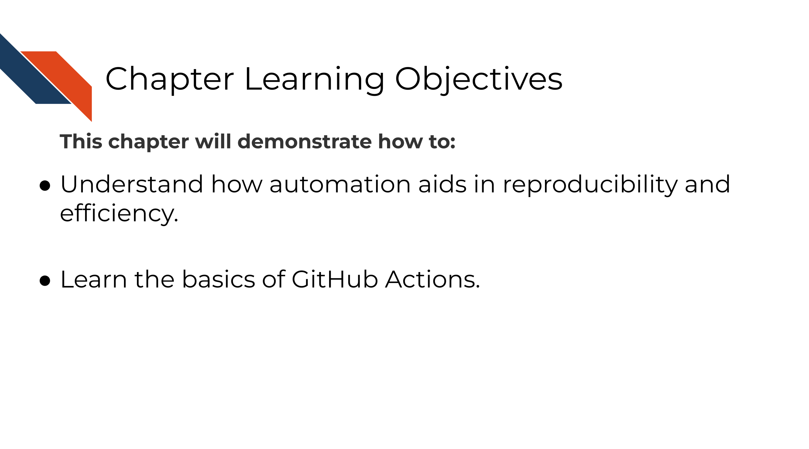

# Automation as a reproducibility tool

## Learning Objectives



***


We've discussed that a reproducible analysis can be run by someone else and obtain the same result. But what if before you bug your colleague to use their time to re-run your analysis, you had a robot re-run your analysis? Robots don't get tired or have other deadlines to respond to and can be set up to re-run your analysis at any time. This is the basis of why automation is powerful tool for reproducibility.


There are a lot of applications for GitHub Actions (see links at the end of this chapter) but in the context of our [R](https://github.com/jhudsl/reproducible-R-example) and [Python](https://github.com/jhudsl/reproducible-python-example) examples or for scientific notebooks in general, it can be useful to build a GitHub Actions that re-runs the notebook every time a pull request is opened.

This is useful because if the notebook does not re-run successfully by GitHub actions, this can be informative to something being amiss in the changes being made.

## Build an example GitHub Actions

### Structure of GitHub actions file

GitHub actions are written yaml file that you store in a folder called `.github/workflows` in your GitHub repository.

They have two main parts:  

- the trigger: `on:`  
- the action: `job:`  

The trigger is specified by `on:` and the action that happens upon the trigger being activated is specified by `jobs:`. The job can be made up of multiple `steps:`.

```
on:
  # Some stuff that specifies when the action should run

jobs:
  # The action that should run
```

### Setting up the trigger

There's a list of things that happen in GitHub that can be used to trigger a GitHub actions. [See the list here](https://docs.github.com/en/actions/learn-github-actions/events-that-trigger-workflows) in this case, we will set up a github action that happens whenever a pull request is opened that is going to the `main` branch.
```
on:
  pull_request:
    branches:
      - main

jobs:
  # The action that should run
```

### Setting up the action

The action part of the GitHub action can be named something (here we are calling it `name-of-job` and we can use the `runs-on:` to specify a docker image to run this on. For this we will use a base image of `ubuntu-latest`.

This simple action will run a bash command `echo` to say `"GitHub action is run!"`.

```
on:
  pull_request:
    branches:
      - main

jobs:
  name-of-job:
    runs-on: ubuntu-latest

    - name: Run message
       run: echo "GitHub action is run!"
```


## Exercise: Set up a GitHub action

Use a <a href="https://docs.github.com/en/actions/learn-github-actions/using-workflow-templates#using-workflow-templates" target="_blank">GitHub Action Template by following these instructions</a>.

You will need to navigate to your own repository to do this.

_Tips for developing a GitHub Action:_  

- As you are adding your GitHub actions, <a href="https://docs.github.com/en/actions/monitoring-and-troubleshooting-workflows/using-workflow-run-logs" target="_blank">consult the GitHub actions log</a>.
- <a href="https://docs.github.com/en/actions" target="_blank">GitHub actions has pretty great documentation</a> so as you are setting up your GitHub actions template, you will want to reference them.
- Be careful with your spacing this will break your GitHub action.
- Take a look at other GitHub actions that are doing something similar to what you are trying to accomplish.
- For testing purposes, modify the trigger so you can test it. You may want to use a
<a href="https://docs.github.com/en/actions/learn-github-actions/events-that-trigger-workflows#manual-events" target="_blank">manual workflow trigger</a> or <a href="https://docs.github.com/en/actions/learn-github-actions/events-that-trigger-workflows#push" target="_blank">`pull request:` and `push:`</a>.
- Use `|` in your `run:` command to give a multi-line command.

### Resources for setting up your GitHub Actions
- [Python example GitHub Actions to re-run notebook](https://github.com/jhudsl/reproducible-python-example/blob/main/.github/workflows/run-python-notebook.yml)
- [R example GitHub Actions to re-run notebook](https://github.com/jhudsl/reproducible-R-example/blob/main/.github/workflows/run-r-notebook.yml)
- [Great course about GitHub actions](https://lab.github.com/githubtraining/github-actions:-hello-world)
- [Introduction to GitHub Actions for data scientists](https://towardsdatascience.com/introduction-to-github-actions-7fcb30d0f959).
