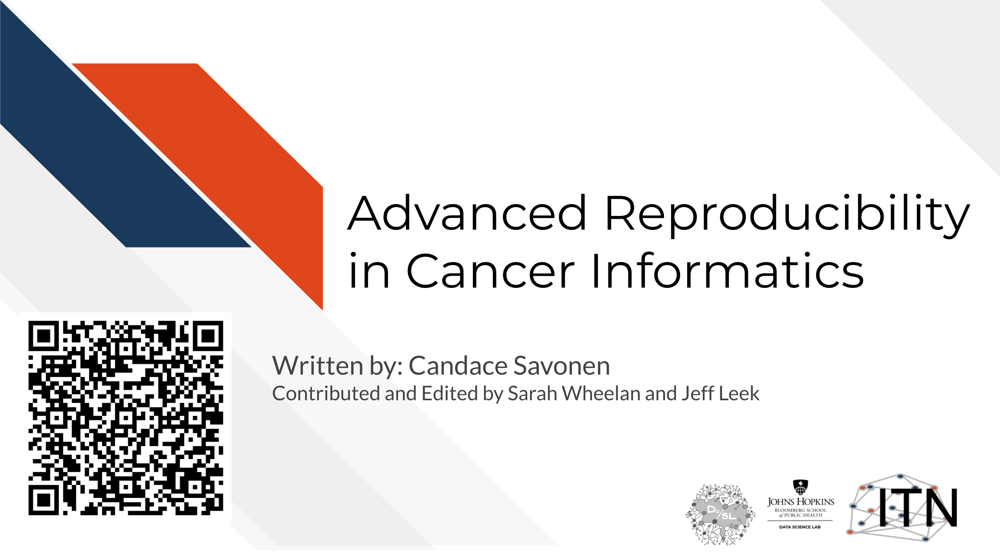

# Introduction

## Topics covered:

This is the second course in a two part series:

## Motivation

Cancer datasets are plentiful, complicated, and hold untold amounts of information regarding cancer biology. Cancer researchers are working to apply their expertise to the analysis of these vast amounts of data but training opportunities to properly equip them in these efforts can be sparse. This includes training in reproducible data analysis methods.

Data analyses are generally not reproducible without direct contact with the original researchers and a substantial amount of time and effort [@BeaulieuJones2017]. Reproducibility in cancer informatics (as with other fields) is still not monitored or incentivized despite that it is fundamental to the scientific method. Despite the lack of incentive, many researchers strive for reproducibility in their own work but often lack the skills or training to do so effectively.

Equipping researchers with the skills to create reproducible data analyses increases the efficiency of everyone involved. Reproducible analyses are more likely to be understood, applied, and replicated by others. This helps expedite the scientific process by helping researchers avoid false positive dead ends. Open source clarity in reproducible methods also saves researchers' time so they don't have to reinvent the proverbial wheel for methods that everyone in the field is already performing.

This course introduces tools that help enhance reproducibility and replicability in the context of cancer informatics. It uses hands-on exercises to demonstrate in practical terms how to get acquainted with these tools but is by no means meant to be a comprehensive dive into these tools.  The course introduces tools and their concepts such as git and GitHub, code review, Docker, and GitHub actions.

## Target Audience  

The course is intended for students in the biomedical sciences and researchers who use informatics tools in their research. It is the follow up course to the [Introduction to Reproducibility in Cancer Informatics course](https://jhudatascience.org/Reproducibility_in_Cancer_Informatics/)

## Curriculum  

**Goal of this course:**  
To equip learners with a deeper knowledge of the capabilities of reproducibility tools and how they can apply to their existing analyses scripts and projects.

**What is NOT the goal of this course**
To be a comprehensive tutorial to each of the tools shown.

## How to use the course

Each chapter has associated exercises that you are encourage to complete in order to get the full benefit of the course

This course is designed with busy professional learners in mind -- who may have to pick up and put down the course when their schedule allows. In general, you are able to skip to chapters you find a most useful to (One incidence where a prior chapter is required is noted).
