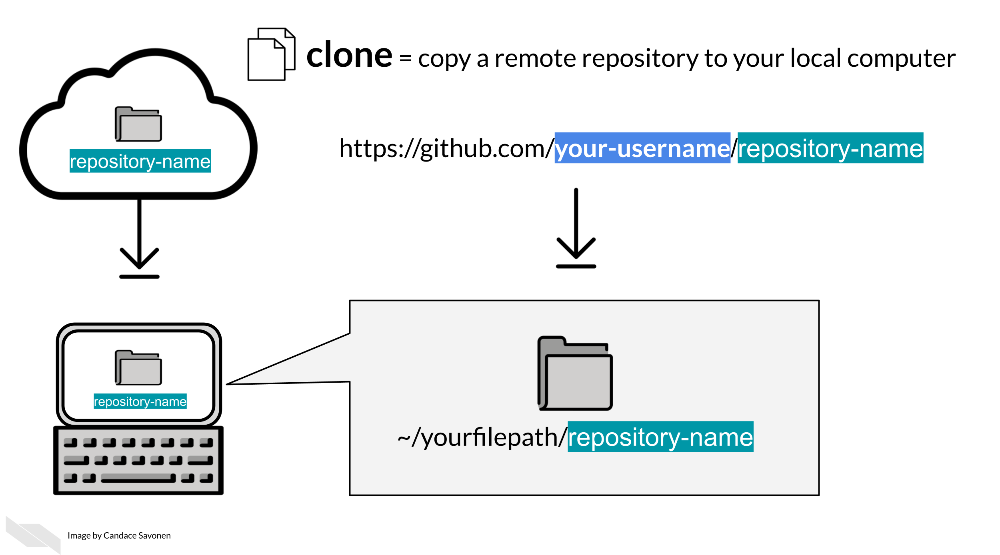
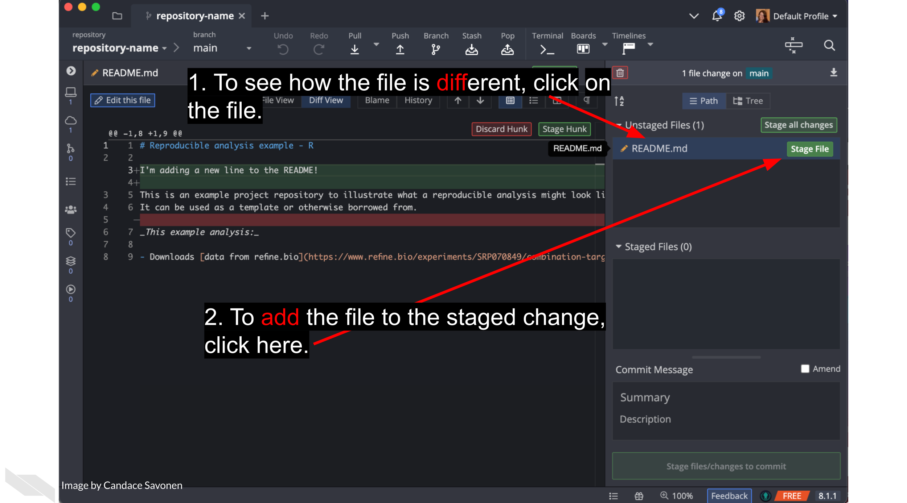

# Using version control with GitHub

## Learning Objectives

In the introductory part of this course, we discussed [some of the reasons for using GitHub](https://jhudatascience.org/Reproducibility_in_Cancer_Informatics/making-your-project-open-source-with-github.html#github-and-git-allow-you-to) but we didn't get into version control (i.e. creating versions for managing changes over time) or GitHub's capabilities much beyond its capacity to store code in a place where others can find it.

In this advanced course, we will dig deeper into Git and GitHub's capabilities so you can use this to your daily work's advantage. However, to gain the benefit of these deeper GitHub skills, you will have to form some new habits. Fully embracing the GitHub workflow will make your work more efficient and help you create more transparent and reproducible analyses!

In this chapter we're going to introduce you to the basic git commands you'll need, and guide you as we do them together one by one!

## Prerequisites for this chapter

In order to complete this chapter **you will need a GitHub account (it's free)**. If you do not currently have a GitHub account, we recommend you go through our [Intro to Github chapter from the Introduction to Reproducibility course](https://jhudatascience.org/Reproducibility_in_Cancer_Informatics/making-your-project-open-source-with-github.html) first, then return to this chapter.

## Set up a Git Client (GitKraken)

Interaction with git and GitHub can be done completely from the command line, but sometimes this can be harder to keep track of. To help us navigate this, we recommend using a git client. There are a lot of different clients out there, and they are generally free for most situations you will need. In this course, we will take you through how to use [GitKraken](https://www.gitkraken.com/git-client), one such git client.

GitKraken is nice because they have lots of nice tutorials, it works pretty well, and its free for most use cases. But if you find GitKraken doesn't work for you, you can explore [other git clients](https://www.hostinger.com/tutorials/best-git-gui-clients/). For this course, we'll be using GitKraken.

### Install GitKraken

[Go here to install GitKraken](https://www.gitkraken.com/).

Follow their instructions to sign in with your GitHub account. It will ask you to authorize your GitHub account to connect to GitKraken. Click `Authorize`.

You may find it helpful to watch GitKraken's own tutorial (linked below) about how to "git" started, but we will also guide you through each step!

<iframe src="https://www.youtube.com/embed/ub9GfRziCtU" width="672" height="400px"></iframe>

GitHub has a host of terms that can feel like a whole language at first, but we'll introduce them one at a time. To start, a lot of the GitHub workflow centers around handling copies of your code that are either stored on the internet (are _remote_) or are stored on your computer (are _local_).

**Remote** = GitHub on the internet  
**Local** = What's on your own computer

A _repository_, in the case of a data science project, is mostly synonymous with the word "project". Using GitHub, a project will exist both as a remote repository and a local repository (in other words, it will be on the internet on GitHub and on your computer).

**Repository** = a set of project files that have a location on GitHub

## Get the exercise project files

In this course, you can work on the exercises from your own GitHub repository, but first we will need to set that up. Below are the files you will want to upload to that repository.

Depending on whether you prefer to use R or Python, you can choose to follow this course using one or the other.

 
**Get the Python project example files**

[Click this link to download](https://raw.githubusercontent.com/jhudsl/Reproducibility_in_Cancer_Informatics/main/chapter-zips/reproducible-python-example.zip).

Now double click your chapter zip file to unzip. For Windows you may have to [follow these instructions](https://support.microsoft.com/en-us/windows/zip-and-unzip-files-f6dde0a7-0fec-8294-e1d3-703ed85e7ebc).

 
**Get the R project example files**

[Click this link to download](https://raw.githubusercontent.com/jhudsl/Reproducibility_in_Cancer_Informatics/main/chapter-zips/reproducible-R-example.zip).

Now double click your chapter zip file to unzip. For Windows you may have to [follow these instructions](https://support.microsoft.com/en-us/windows/zip-and-unzip-files-f6dde0a7-0fec-8294-e1d3-703ed85e7ebc).

## Start a GitHub repository

- Go to [Github's main page](https://github.com/) and sign in with your GitHub account.
- Follow [these instructions to create a repository](https://docs.github.com/en/get-started/quickstart/create-a-repo). As a general, but not absolute rule, you will want to keep one GitHub repository for one analysis project.
  - Name the repository something that reminds you what its related to. For these examples, we're calling using `repository-name` as our placeholder.
  - Choose `Public`.
  - Choose `add a README`.
- Follow [these instructions](https://docs.github.com/en/repositories/working-with-files/managing-files/adding-a-file-to-a-repository#adding-a-file-to-a-repository-on-github) to add all the files that are inside the `reproducible-R-example.zip` or `reproducible-python-example.zip` file you downloaded to this new repository.

### git clone

Now you have a repository on GitHub online!

In our daily grind, we will work on this code from our own computer. To set this up, we'll need to `clone` it to our own computer. Cloning is making a remote copy of the project local.

**clone** = To make a remote repository local. In other words, to make an online repository downloaded and linked on your computer.

To get started, you will need to clone the GitHub repository you created. We will be using this repository for the duration of this course.

It is simple to clone a GitHub repository using GitKraken. First, sign in to GitKraken; under Repository Management > Clone tab, click `Clone a repo`. Then, choose where you’d like the repository to be on your computer using the `Browse` button. You will need to `Copy + Paste` your new repository's URL (web address) to  where it says `URL`.

Navigate to your repository on GitHub to copy the URL. Copying and pasting is advisable because any little typo will inhibit cloning.

Now you are ready to click `Clone the repository`! It will ask you if you'd like to `Open Now`, click that.

### Create a branch

Handling branches is where you unleash the real benefit of GitHub, but it's also the confusing part to get the hang of.

**branch** = a unique working copy of file changes of a GitHub repository. A branch can be local and remote.

The best way to get a grasp on what the branches represent is to create one and start using it.

In GitKraken we can create a new branch; this will be your working copy. First, click the Branch button. Next, type in a branch name in the box that the cursor is blinking in. In our example, we are calling it `a-new-branch`. Now click `Enter`! Now you have a new branch!

Now we can edit our files and code however we normally would. Go ahead and make an edit to any file in your new repository.

If you've made a change to any file in your repository, it will appear in GitKraken and you can click on it to see the differences.

If we want to add these file changes to our current branch, we need to `commit` them.

**add** = to stage your files to be committed to your current branch.  
**commit** = include your set of file changes to your current branch.

Now that we have changes committed to our branch we are ready to add them to the remote, internet copy! To do this, we will need to `push` our branch.

To push means to add changes that are on your new branch to the remote branch (internet version). You can select your _origin_, which refers to where your branch is stored on the internet. Choose your origin in the dropdown menu and click Submit.

**origin** = where your branch is stored on the internet (remotely)
**push** = to add changes from your branch to its remote counterpart. In other words, put your changes online.

After a variable number of commits, your branch, called `a-new-branch`, is a different version of the original code base that may have a nifty improvement to it. But our main goal is to add that nifty improvement to the main branch. To start this process of bringing in new changes to the main curated repository, we will create a `pull request`.

**pull request** = A way to propose changes from a branch to be included into the main repository.
 
From GitHub:
> Pull requests let you tell others about changes you've pushed to a GitHub repository. Once a pull request is sent, interested parties can review the set of changes, discuss potential modifications, and even push follow-up commits if necessary.

Pull requests are the meat of how code changes and improvements get reviewed and incorporated! A vast majority of the benefits of incorporating GitHub into your workflow centers around fully utilizing the power of pull requests!

Now we can open up a pull request if we go to our GitHub repository on GitHub.

After you click on `Compare & pull request` you'll be taken to a screen where you can add information about your changes. After you are done writing your description, click `Create Pull Request`! (If you don't have your pull request description _perfect_ don't worry about it, you can always edit it later).

Congrats! You've just opened a pull request!

In an upcoming chapter we will discuss what information you should put in this pull request description to make it pertinent for yourself and whoever reviews your pull request.

To summarize, below is what this workflow looks like:

One more note: if you do want to use the command line or if you want to know more about the specific git commands that GitKraken is doing for you (which might be handy for troubleshooting), **the specific commands that can be used or Googled at each step are highlighted in red in the images** - you just need to add `git` before them! For example, you would type `git push` in your command line in order to push your code. Or if you'd like to know more about pushing code, you can google `git push`.

## More resources for learning GitHub

- [Happy Git and GitHub for the useR](https://happygitwithr.com) by @Bryan2021.
- [GitHub for data scientists](https://towardsdatascience.com/introduction-to-github-for-data-scientists-2cf8b9b25fba) by @Vickery2019.
- [Intro to GitHub](https://github.com/skills/introduction-to-github) by @GitHub2022.
- [First Day on GitHub](https://skills.github.com/#first-day-on-github) by @GitHub2022c.
- [First Week on GitHub](https://skills.github.com/#first-week-on-github) by @GitHub2022d.
- [GitHub docs about creating a Pull Request](https://docs.github.com/en/pull-requests/collaborating-with-pull-requests/proposing-changes-to-your-work-with-pull-requests/creating-a-pull-request) by @GitHub2021b.
- [Making a Pull Request](https://www.atlassian.com/git/tutorials/making-a-pull-request) by @Radigan2021.

**If you have any feedback on this chapter, please [fill out this form](https://forms.gle/j3cJZX5CmNtQp6QKA), we'd love to hear your feedback!**
