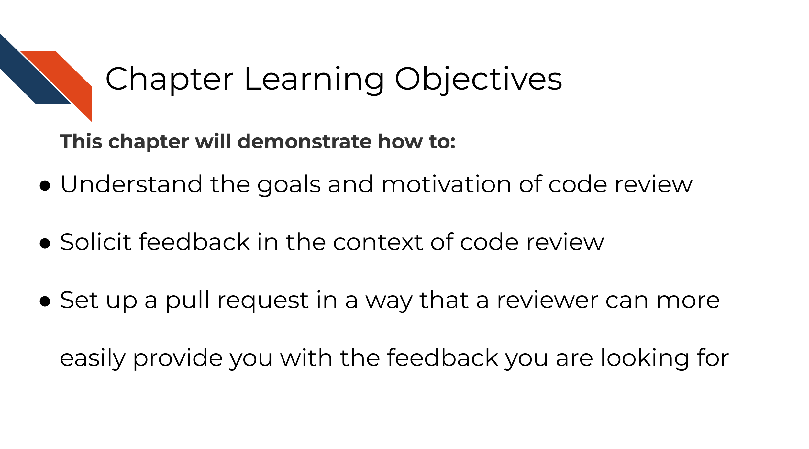
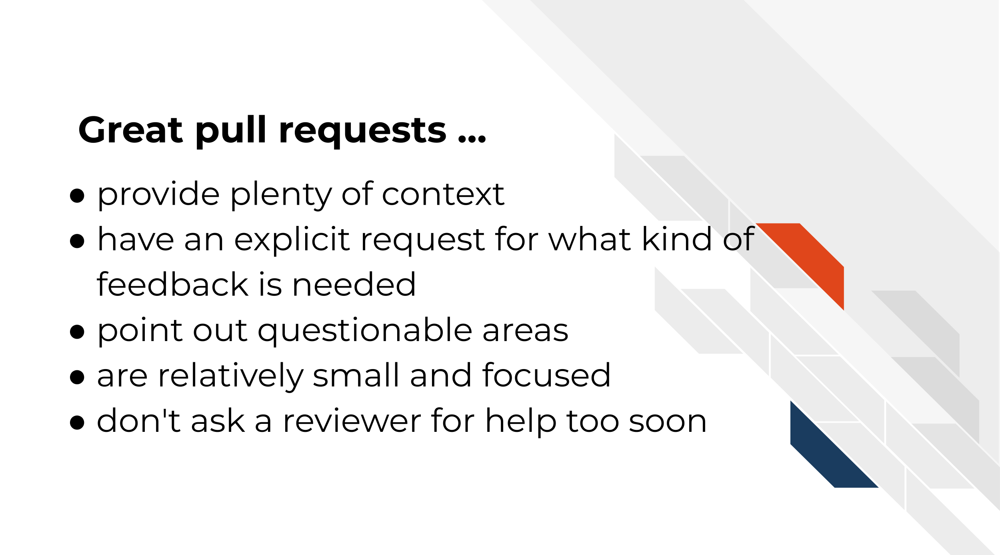
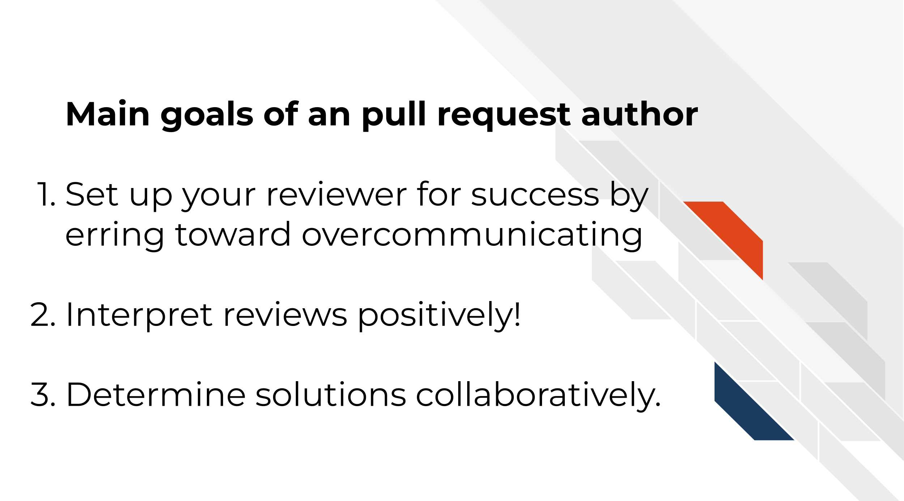
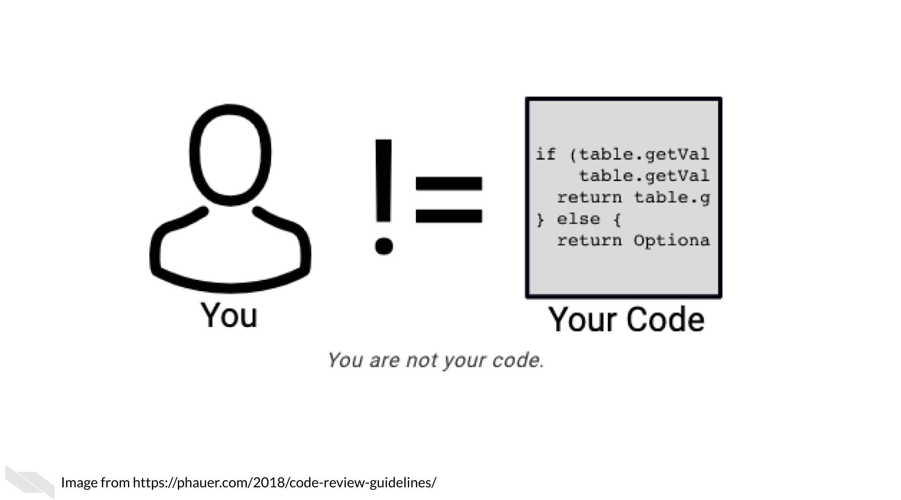

# Engaging in Code Review - as an author

## Learning Objectives

We've previously discussed that the only way to know if your analysis is truly reproducible is to send it to someone else to reproduce! That sentiment is at the heart of code review. Although most wouldn't dare send out a manuscript for publishing without having our collaborators giving it a line-by-line review, people don't always feel the same way about code.

@Parker2017 describes code review:

> Code review will not guarantee an accurate analysis, but it’s one of the most reliable ways of establishing one that is more accurate than before.

Not only does code review help boost the accuracy and reproducibility of the analysis, it also helps everyone involved in the process learn something new!

An effective code review atmosphere is something that individuals and their team have to _commit_ to (pun intended). Effective code review brings so many benefits not only to your project quality but also your communication skills through fostering a learning atmosphere!

In this chapter and the next we will discuss the two sides of code review. Code review ideally includes at least two people: the author of the pull request and the reviewer of the pull request. Depending on your job context, we realize that sometimes authors have to become their own reviewers if code review is not something that can be prioritized by your institution or team.

## Author responsibilities in code review

The code review process begins with the creation of a pull request (which we practiced in the previous chapter). Successful and efficient code review is born out of quality communication, which is a skill set on its own. You can set up your reviewers (and yourself) up for success by knowing what basic information can help get the code review conversation going.

Even if you end up being the only person who will review your own code, writing these things out is still very helpful and highly recommended. It can help you spot problems you might not have otherwise seen and generally help you document better for future you!

## Characteristics of great pull requests

### There's plenty of context!

What's the story behind around the changes you are proposing? Sometimes when we are in the thick of a project we can make the mistake of assuming everyone knows what we know. This can unfortunately leave a huge burden on your reviewer to try to follow a paper trail to try to understand what you are doing.

Before sending off a review request, re-read your PR description and think about the perspective of your reviewer. Err on the side that they have no idea what is happening on the project (because sometimes this is the case!)

Tell a short story to explain what lead to you making these changes including attempting to answer these questions:  

- What is the problem that these changes will solve?
- Do you have any URLs relevant issues or files you can share?
- What inspired you to take this approach -- are there other things you tried?
- Are there other pull requests related to this change?

### Includes an explicit request for what kind of feedback is needed

What would you like your reviewer to do with this pull request? Stating this explicitly can save both of you time in this code review.

- Are you still in the early stages and looking for a bigger picture review? Let them know that before they waste their time digging into the code line-by-line.
- Are you in the later stages and looking for detailed nit-picky review?
- Are you looking for feedback on the results or methods?

### Points out questionable areas that need extra attention

Are there specific areas of the code you are having trouble with or are unsure about? Send a link to the [specific lines in GitHub](https://stackoverflow.com/questions/23821235/how-to-link-to-specific-line-number-on-github) you are asking about. Are there results that are surprising, confusing, or [smell wrong](https://github.com/jennybc/code-smells-and-feels#code-smells-and-feels)?  

Be sure to detail what you have dug into and tried at this point for any problematic points.   

### Are relatively small and focused

Try to make sure your pull requests aren't too long! Code reviewing fatigue is very real. If you send a reviewer thousands of lines of code to review it will be very overwhelming to review or understand.

<blockquote class="twitter-tweet">
10 lines of code = 10 issues.  500 lines of code = &quot;looks fine.&quot;  Code reviews.
&mdash; I Am Devloper (@iamdevloper) <a href="https://twitter.com/iamdevloper/status/397664295875805184?ref_src=twsrc%5Etfw">November 5, 2013</a></blockquote> 

Alternatively, when you create a new branch try to set a very intentional (and relatively small) goal you would like to achieve with your upcoming pull request. Keeping your pull requests small and focused on one task at a time will not only help your reviewers but also will help yourself feel more accomplished and organized.

Also recall that incremental changes are good! Perhaps you do have a very large restructuring of your repository you are trying to accomplish, but finding smaller reasonable sets of changes (which would each have their own pull requests) to reach that goal incrementally can help keep things more manageable.

[Using Stacked Pull Requests in GitHub](https://blog.logrocket.com/using-stacked-pull-requests-in-github/)

### Don't ask a reviewer to dig through dirty code

Determining when a pull request fully cooked and ready for review is a skill in itself. Pull requests that haven't had enough time to be polished can put an unnecessarily larger burden on the reviewer. On the other hand, pull requests that have been hashed and rehashed in a silo might have benefitted from big picture feedback at an earlier stage of the code. This is something that you and your team can figure out a balance for in time using lots of communication!

This being said, the first reviewer of your code should always be yourself! Take time to review your own changes by clicking on the `Files Changed` tab and going over that section carefully.

- Are all the changes included that you were expecting?
- Are there any changes you didn't expect that are showing up? These can be symptomatic of a deeper problem. Definitely dig into anything that is not what you expected.
- Set aside your changes and return them in a few hours, or the next day. Looking at your changes with fresh eyes may also allow you to find things you didn't notice before.

Additional tip, if you don't want others to look at your pull request yet because you are still working on reviewing it, you can change it to [a draft pull request](https://github.blog/2019-02-14-introducing-draft-pull-requests/) so no one reviews it before you are ready. This can also be a handy tactic to use if you just want to ask for big picture feedback someone but want to make it clear that it is not anywhere near ready for merging to main.

#### In summary:

Let's revisit our scenario with Avi and Ruby and see how Ruby could better prepare her changes for review:

In this scenario Ruby was able to save Avi time in getting into the code review by being more specific about what kind of feedback she is looking for as well as links that explain the context behind these changes. Additionally, by supplying Avi with a smaller PR, Avi is less likely to be overwhelmed by Ruby's request and be able to give her suggestions in a more timely manner.

## Exercise: Create your pull request description

Add a [pull request template](https://docs.github.com/en/communities/using-templates-to-encourage-useful-issues-and-pull-requests/creating-a-pull-request-template-for-your-repository) to your repository! This will help initiate consistent and clear communication around the pull requests in your repository.

Pull request templates are a way to give yourself and other contributors prompts when starting a new pull request. See below for an example. The comments between `<!--` and `-->` are html comments that will not show up so you don't need to delete them if you don't want to. On the right side, it shows how this template looks when it's rendered. You can see this at any time by clicking `Preview` -- this is true in other places in GitHub.

#### Set up a pull request template

1. Create a new branch as we described in the previous chapter.
2. In your local repository, create a folder called `.github`
3. Copy and paste this [pull request template file](https://raw.githubusercontent.com/jhudsl/Adv_Reproducibility_in_Cancer_Informatics/main/.github/PULL_REQUEST_TEMPLATE.md) to a new text file and save it as a `.md` to get started.
4. Feel free to edit this file to your own needs and add it to the `.github` folder of your repository.
5. Use GitKraken to `add` and `commit` this new file.
6. Push this commit.
7. Open up a pull request.
8. Craft your pull request description based on what we discussed in this chapter.
9. Click on the `Files Changed` tab and make sure it includes the `.github/PULL_REQUEST_TEMPLATE.md` file.
10. Walk away from your pull request and then return later and review it yourself.
11. Make any necessary changes.
12. When you are ready, [request a reviewer](https://docs.github.com/en/pull-requests/collaborating-with-pull-requests/proposing-changes-to-your-work-with-pull-requests/requesting-a-pull-request-review) by choosing someone underneath `Reviewer` on the right side!

### Preparing for the return of your review

As you wait for your reviewer to get back to you, it can be helpful to remind yourself the purpose of code reviews get yourself in a positive mindset. You've given your reviewer information to help them help you and now is the time to wait.

First of all, you should pat yourself on the back for engaging in code review. It does require more time and sometimes that can feel scary with looming deadlines, but kudos for being able to prioritize your commitment to creating increasingly reproducibility analyses!

Remember that you are not your code and mistakes are all a part of the process! Putting your project out there can feel a tad vulnerable even. You may have felt the impulse to keep your code's problems buried under a rug, but you pushed past that and are making your analyses transparent! Remember that hidden problems don't get solved, but known problems are opportunities for reaching an even better end result than you imagined!

When you receive a review back remember that you and the reviewer are on the same team and both want the best end result feasible for this project! They may suggest ideas that you love and can't wait to implement. They also might suggest ideas you don't agree with. Do your best to take all their comments as positive learning opportunities and look for ways to compromise and determine solutions collaboratively.

#### Recommended reading about code review

- [Why code reviews matter (and actually save time!)](https://www.atlassian.com/agile/software-development/code-reviews) by @Radigan2021.
- [Pull request descriptions](https://www.pullrequest.com/blog/writing-a-great-pull-request-description/) by @Banuelos2020.
- [A zen manifesto for effective code reviews](https://www.freecodecamp.org/news/a-zen-manifesto-for-effective-code-reviews-e30b5c95204a/) by @Fabre2019.
- [Best practices for Code Review](https://smartbear.com/en/learn/code-review/best-practices-for-peer-code-review/) by @Smartbear2021.

**If you have any feedback on this chapter, please [fill out this form](https://forms.gle/j3cJZX5CmNtQp6QKA), we'd love to hear your feedback!**
